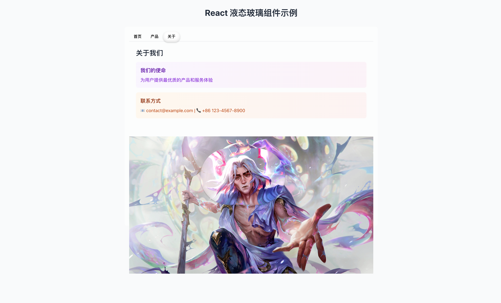

# LiquidGlass 液态玻璃组件

[English README](README.en.md)

一个基于 React、TypeScript 与 SVG 滤镜实现的高质量、可定制的液态玻璃效果组件。

## React + TypeScript + Vite

本项目内置了一个高质量、可定制的液态玻璃效果组件，源码位于：

- `src/components/LiquidGlass/index.tsx`
- `src/components/LiquidGlass/index.css`

该组件使用 SVG Filter（`feDisplacementMap`）与隐藏 Canvas 生成的位移贴图实现「果冻感」的毛玻璃扭曲效果，支持圆角、位移强度、动画平移等特性，适用于仪表盘、悬浮窗、卡片背景等场景。

### Example



## 主要特性

- **纯前端实现**：基于 Canvas + SVG Filter，无第三方依赖。
- **可定制**：宽高、圆角、位置、类名与行内样式均可自定义。
- **流体扭曲**：利用自定义片元逻辑生成位移图，边缘可羽化，具有柔和「果冻」质感。
- **动画支持**：提供 `LiquidGlassAnimation` 包装组件，支持 X 轴平移并带有轻微果冻弹性动画。

## 快速开始

```tsx
// 在任意组件中使用，例如 src/App.tsx
import React from "react";
import LiquidGlass, {
  LiquidGlassAnimation,
} from "./src/components/LiquidGlass";

export default function Demo() {
  return (
    <div
      style={{ height: "100vh", background: "#eceff1", position: "relative" }}
    >
      {/* 基础毛玻璃卡片 */}
      <LiquidGlass
        width={320}
        height={200}
        borderRadius={24}
        style={{ position: "absolute", top: 60, left: 40 }}
      />

      {/* 带动画的毛玻璃卡片（X 轴平移） */}
      <LiquidGlassAnimation
        translateX={40}
        width={280}
        height={160}
        borderRadius={18}
        style={{ position: "absolute", top: 300, left: 40 }}
      />
    </div>
  );
}
```

> 注意：路径按你的项目组织自行调整；若使用 Vite 的 `@` 别名，请改为 `@/components/LiquidGlass`。

## API（Props）

`LiquidGlass` 组件：

- **width?**: number（默认 300）
- **height?**: number（默认 200）
- **borderRadius?**: number（默认 150）卡片圆角
- **className?**: string 自定义类名（可配合 `index.css` 自定义）
- **style?**: React.CSSProperties 行内样式（可覆盖默认 `backdropFilter` 等）
- **position?**: `{ x: number; y: number }` 相对位移（会映射到容器的 `top/left`）
- **onMouseDown? / onMouseMove? / onMouseUp?**: 事件回调（可用于拖拽等）

`LiquidGlassAnimation` 组件额外支持：

- **translateX?**: number（默认 0）X 轴平移，内部带有轻微果冻动画效果

## 自定义与调优建议

- **毛玻璃强度**：在组件内部容器的 `style.backdropFilter` 中，`blur(px)` 越大越「毛」。默认非常弱（`blur(0.25px)`），建议按需提高至 `4px ~ 12px`。
- **扭曲强度**：由 SVG `feDisplacementMap` 的 `scale` 控制。组件会根据位移图自动估算并设置，可在 `src/components/LiquidGlass/index.tsx` 中的 `updateDisplacementMap` 函数里调节系数（搜索注释“位移强度”）。
- **边缘羽化**：在 `fragment` 回调中通过 `smoothStep` 与 `roundedRectSDF` 控制（有中文注释）。提高阈值差可让边缘更「毛」。
- **性能**：组件会根据 `width/height` 动态生成位移贴图。若需要大量实例，建议合理控制尺寸或复用参数，避免频繁变更尺寸导致重算。

## 浏览器兼容

- 依赖 `SVG feDisplacementMap` 与 `backdrop-filter`（或 `filter: blur()`）效果：主流 Chromium、Firefox、Safari 均有支持。具体表现依浏览器实现略有差异。
- 移动端同样可用，但建议在目标设备上实测效果与性能。

## 目录结构

- `src/components/LiquidGlass/index.tsx`: 组件实现与动画包装
- `src/components/LiquidGlass/index.css`: 样式（可按需扩展）

如需二次开发，可直接阅读 `index.tsx` 内中文注释（核心函数：`fragment`、`updateDisplacementMap`）。

---

本项目灵感参考自 [shuding/liquid-glass](https://github.com/shuding/liquid-glass)，并在其基础上进行了 TypeScript 重构、中文注释补充与 API 扩展，适配了 React 及更易用的动画封装。  
如需深入理解原理或探索更多用法，建议阅读原仓库的源码与文档。
